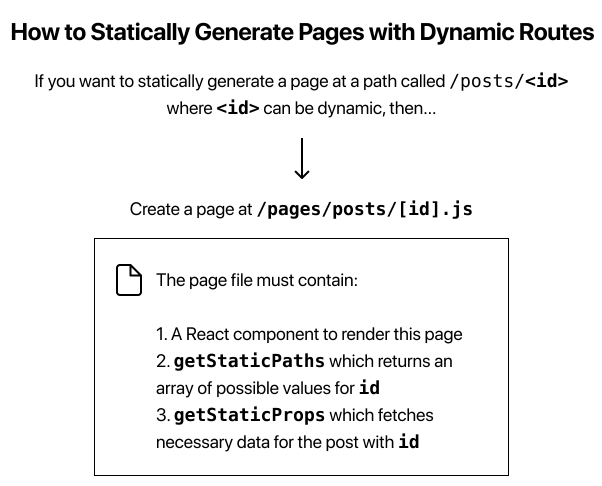

# Dynamic Routes

>   import Layout from '../../components/layout'

    export default function Post() {
    return <Layout>...</Layout>
    }

    export async function getStaticPaths() {
    // Return a list of possible value for id
    }

    export async function getStaticProps({ params }) {
    // Fetch necessary data for the blog post using params.id
    }

## Summary 

## Implement getStaticPaths
> - Create a file called [id].js inside the pages/posts directory.
  - Also, remove first-post.js inside the pages/posts directory — we’ll no longer use this.

- Code
>   import Layout from '../../components/layout'

    export default function Post() {
    return <Layout>...</Layout>
    }

>   export function getAllPostIds() {
    const fileNames = fs.readdirSync(postsDirectory)

    // Returns an array that looks like this:
    // [
    //   {
    //     params: {
    //       id: 'ssg-ssr'
    //     }
    //   },
    //   {
    //     params: {
    //       id: 'pre-rendering'
    //     }
    //   }
    // ]
    return fileNames.map(fileName => {
        return {
        params: {
            id: fileName.replace(/\.md$/, '')
        }
        }
    })
    }

## Implement getStaticProps
>   import { getAllPostIds, getPostData } from '../../lib/posts'

    export async function getStaticProps({ params }) {
    const postData = getPostData(params.id)
    return {
        props: {
        postData
        }
    }
    }

# Deploying - Next.js App

### Push to GitHub
> git remote add origin https://github.com/<username>/nextjs-blog.git
  git push -u origin main

### Deploy to Vercel
- sign up 
- Import nextjs-blog repository(Github)

#### Extra Features on Vercel
- Custom Domains
- Environment Variables
- Automatic HTTPS
